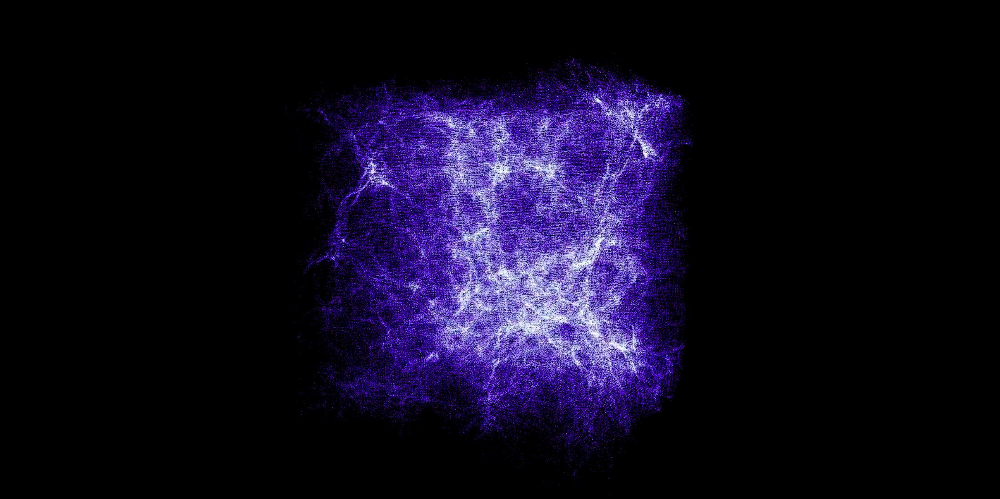
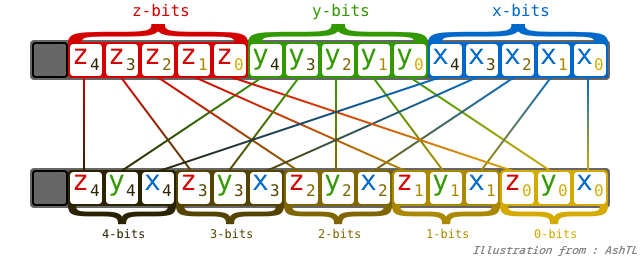
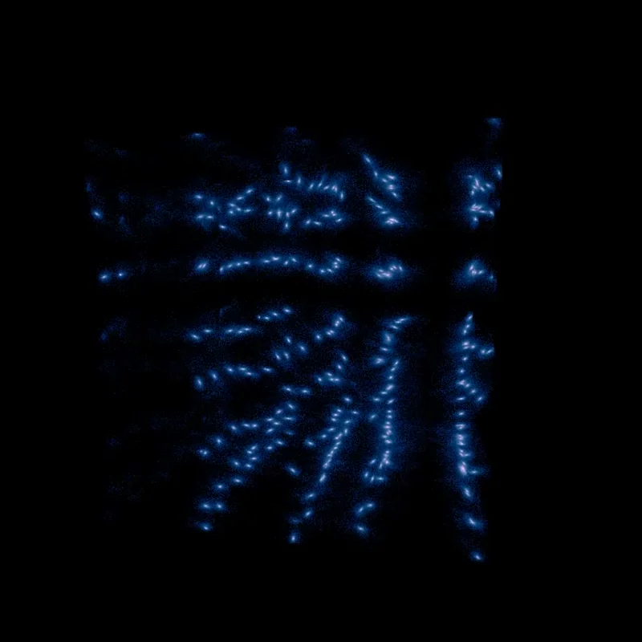
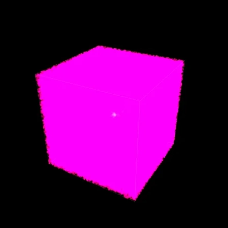

<div align="center">
  

  <br>

  # Cosmo-NBody GPU: High-Performance Cosmological Simulation

  [](https://python.org)
  [](https://cupy.dev/)
  [](https://numba.pydata.org/)
  [](https://en.wikipedia.org/wiki/Barnes%E2%80%93Hut_simulation)
  
  <br>
</div>

> A purely Python-based, fully GPU-accelerated $N$-Body simulation engine designed to model the gravitational evolution of the cosmic web.

 
**Cosmo-NBody GPU** is a proof of concept to demonstrate the performances of Python in High-Performance Computing (HPC). By bypassing standard CPU bottlenecks, this engine simulates over 2 million interacting dark matter particles ($N = 128^3$) natively in VRAM. 

It implements a completely custom, parallelized Barnes-Hut octree, generates cosmological initial conditions via the Zel'dovich Approximation, and includes an in-house volumetric density renderer driven by CUDA atomic operations.

The comsological accuracy aspect of the project is largely under exploited here. Futur improvement will primarily include this aspect. 

---

## Core Physics & Algorithmic Architecture

### 1. Cosmological Initial Conditions (Zel'dovich Approximation)
Standard random distributions do not accurately represent the early universe. This engine generates initial conditions by applying the [**Zel'dovich Approximation**](https://arxiv.org/pdf/1401.5466) to a primordial power spectrum.
* Computes the initial density perturbation field in Fourier space using $P(k) \propto k^{-2.5}$.
* Applies a random uniform phase $\phi \in [0, 2\pi]$:
  $$\delta_k = \sqrt{P} (\cos \phi + i \sin \phi)$$
* Uses an Inverse Fast Fourier Transform (iFFT) to compute the spatial displacement field $\vec{d}$.
* Velocities are strictly coupled to the spatial displacements using the Hubble parameter $H_{start}$, the scale factor $a_{start}$, and the density parameter $\Omega_m$.

### 2. Parallel Barnes-Hut Tree & Spatial Locality
\
Calculating $O(N^2)$ gravitational interactions for $2 \times 10^6$ particles is computationally unfeasible. We reduce this to $O(N \log N)$ using a Barnes-Hut tree built entirely on the GPU.
* **63-bit Morton Encoding:** 3D spatial coordinates are normalized and scaled by $2^{21}$. The bits of the $X, Y, Z$ axes are interleaved using bitwise shifts and masks to generate a single 63-bit integer (Z-order curve). This ensures maximal spatial memory locality for GPU threads.
* **Parallel Radix Tree:** Implements Tero Karras' (2012) algorithm to construct the tree structure in parallel by calculating the common leading zeros between sorted Morton codes.
* **Multipole Expansion:** Traverses from the leaves up to the root, accumulating node masses and computing the normalized Centers of Mass (CoM) via atomic operations.

### 3. Cosmological Symplectic Integration
\
*Illustration from Wikipedia*\
The simulation takes place in an expanding universe, governed by the [scale factor $a$](https://en.wikipedia.org/wiki/Scale_factor_(cosmology)), the Hubble constant $H_0 = 67.8$, matter density $\Omega_m = 1.0$, and dark energy $\Omega_\Lambda = 0.692$.
* The Hubble parameter evolves over time: 
  $$H(a) = H_0 \sqrt{\Omega_m a^{-3} + \Omega_\Lambda}$$
* A simple symplectic integrator steps the physics forward. It applies a [**Hubble drag**](https://en.wikipedia.org/wiki/Hubble%27s_law) to the particle velocities and scales the gravitational forces by $1/a$.
* Positions drift relative to the expanding coordinate system using a drift factor of $1/a$.

### 4. Native Volumetric Rendering Pipeline

Instead of exporting coordinates to an external engine, rendering is handled internally via a custom graphics pipeline, preventing massive memory transfers to the CPU.
* Computes a full Model-View-Projection (MVP) matrix allowing a virtual camera to orbit the expanding box.
* **CUDA Render Kernel:** Transforms 3D particle positions into 2D clip-space. Calculates an inverse-depth weight and accumulates pixel density using `cuda.atomic.add` onto a 2D CuPy grid.
* **Colorimetry:** Applies a non-linear power mapping ($\gamma = 2.2$) to the accumulated density field, mapping intensities across a predefined Blue $\rightarrow$ Green $\rightarrow$ Yellow $\rightarrow$ Red spectrum.
* Outputs directly to an `mp4` via `FFmpeg`.

---

## System Requirements & Installation

**Hardware:**
* A CUDA-capable NVIDIA GPU (Minimum 8GB VRAM recommended for batch sizes of $5,000 - 10,000$ and $N_{bodies} = 2,097,152$).

**Software:**
* Python 3.8+
* `FFmpeg` installed and added to your system's PATH.

**Dependencies:**
First create an environment:
```bash
conda create -n cosmo-nbody python=3.12 -y
```

Now activate it:
```bash
conda activate cosmo-nbody
```

Then install dependencies: *Beaware that issues can rise from versions mismatch from you driver and CUDA installation*
```bash
conda install -c conda-forge numba cupy tqdm pillow
```

Optional: check if everything is working properly
```bash
import tqdm, PIL, numba, cupy
print(f"CuPy device: {cupy.cuda.Device(0)}")
print(f"Numba version: {numba.__version__}")
```

**Installation :**
Copy the repository:
```bash
git clone https://github.com/AdriosG/Cosmo-NBody && cd Cosmo-Nbody
```

Reference the project src/
```bash
pip install -e .
```

You can execute simulation via `main.py` file.

---

## Structure

```Plaintext
├── main.py                     # Entry point & high-level execution
├── src/
│   ├── core/
│   │   ├── engine.py           # Master simulation loop orchestrator
│   │   ├── state.py            # Pre-allocated GPU array state manager
│   │   ├── octree.py           # Barnes-Hut tree interface
│   │   └── camera.py           # VRAM-to-Disk flush and FFmpeg video compiler
│   ├── kernels/
│   │   ├── physics_kernels.py  # Force evaluation & cosmological integrator
│   │   ├── render_kernels.py   # Atomic MVP matrix projection & density accumulation
│   │   └── tree_kernels.py     # Parallel radix tree & bitwise traversal
│   └── utils/
│       ├── cosmology.py        # Power spectrum & Zel'dovich displacement generation
│       ├── morton.py           # 63-bit Z-order curve bitwise interleaving
|       ├── config.py           # HPC constants, grid size, and cosmology parameters
│       └── visualizer.py       # Camera math (LookAt, Perspective) & HDR colormaps
```

---

## 📷 Some Renders!

Here are some renders made troughout the developpment of this project.

**Some Nice Ones:**

|  |  |
| :---: | :---: |
| <br>**Supernova Simulation** | <br>**Dark Energy Rendering** |
| <br>**Density Rendering** | <br>**Galaxy-scale Gravity Pit** |


**The fails:**

|  |  |
| :---: | :---: |
| <br>**Gravity Tests** | <br>**Initial conditions Tests** |
| <br>**Non-Conservative Energy Bug** | <br>**Combined Issues** |
| <br>**Zel'Dovich Trials** | <br>**Camera Movement Fail** |


---

## Open Source & Licensing

This project is an open framework for high-performance astrophysical programming in Python. Contributions regarding multi-GPU scaling (via NCCL/MPI) or higher-order integrators are actively welcomed.

Licensed under the MIT License.